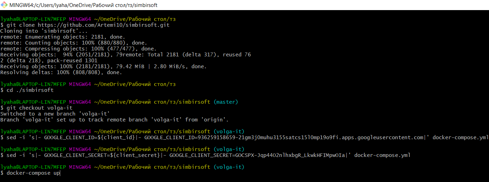
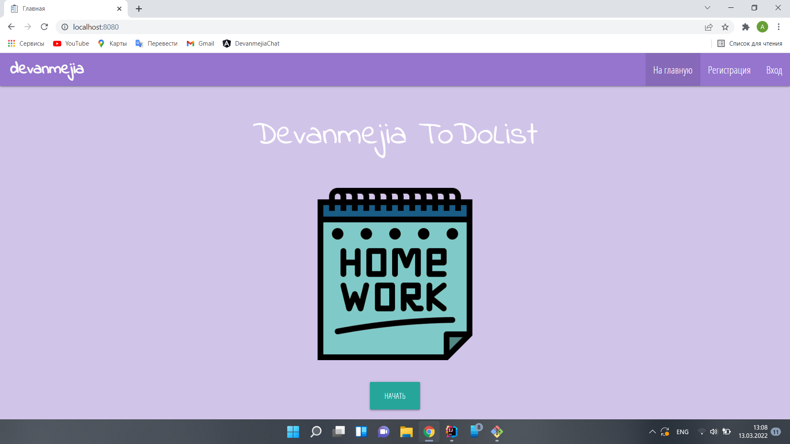

# Devanmejia ApplicationsList
>Simple CRUD Spring Boot project

## Table of Contents
* [General Info](#general-info)
* [Technologies Used](#technologies-used)
* [Features](#features)
* [Deployment](#deployment)
* [Contact](#contact)

## General Info
- Application allows authorized users to create, store, update and delete information about applications.
- Users can easily manage their own applications.

## Technologies Used
- Java 17
- Spring Boot:
    * Spring Data JPA
    * Spring Security
- Lombok
- Tests:
    * JUnit
    * Mockito
- Postgresql
- Thymeleaf
- Materialize js

## Features
- Create account by filling out sign up form.
- Log in to user account with/without remember me token.
- Password recovery by sending resetting letter to user email.
- Log out from application.
- CRUD operations with applications.

## Deployment
- Download git project
> git clone https://github.com/Artemi10/simbirsoft.git
- Enter to project directory
> cd ./simbirsoft
- Chose volga-it branch
> git checkout volga-it
- Create Google OAuth client ID credentials
> https://console.cloud.google.com/apis/credentials
- Add to docker-compose.yml file Client ID and Client Secret
> - GOOGLE_CLIENT_ID=${client_id}
> - GOOGLE_CLIENT_SECRET=${client_secret}
- Start docker engine
- Run docker-compose command
> docker-compose up
- Open project in browser
> http://localhost:8080/

## Contact
Email: lyah.artem10@mail.ru
